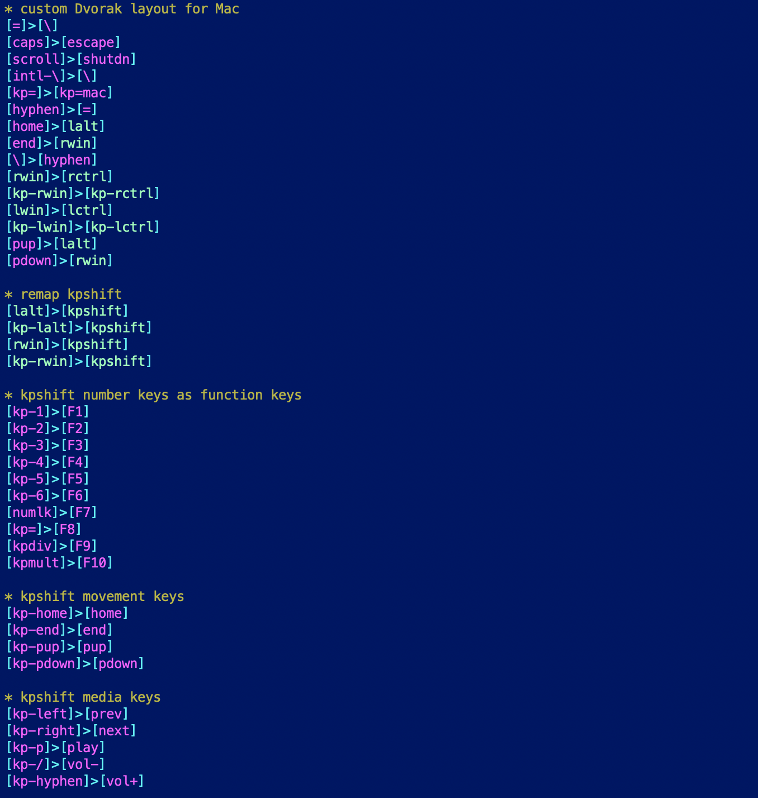

# vim-kinesis

Vim syntax highlighting of layout files for the
[Kinesis](https://kinesis-ergo.com)
[Advantage2](https://kinesis-ergo.com/keyboards/advantage2-keyboard/),
[Freestyle Pro](https://kinesis-ergo.com/keyboards/freestyle-pro-keyboard/) and
[Freestyle Edge](https://gaming.kinesis-ergo.com/edge/) keyboards.

## Installation

### Using a package manager

Clone the repository in the bundle directory of your favorite Vim
package installer like [pathogen](https://github.com/tpope/vim-pathogen)
or [Vundle](https://github.com/VundleVim/Vundle.Vim).

### Manually

Put the `syntax/advantage2.vim` and `syntax/freestyle.vim` files in your user
runtime directory where syntax files are searched for by Vim (normally
`$HOME/.vim/syntax`).

### Filetype detection

To have Vim automatically detect the type of file, add the lines

```vim
autocmd BufNewFile,BufRead ?_{qwerty,dvorak}.txt,{qwerty,dvorak}.txt set filetype=advantage2
autocmd BufNewFile,BufRead layout[123456789].txt set filetype=freestyle
```

in your `.vimrc` or in the file `filetype.vim` in your user runtime directory
(normally `$HOME/.vim`).

## Screenshot



## License

See [LICENSE.txt](LICENSE.txt).
